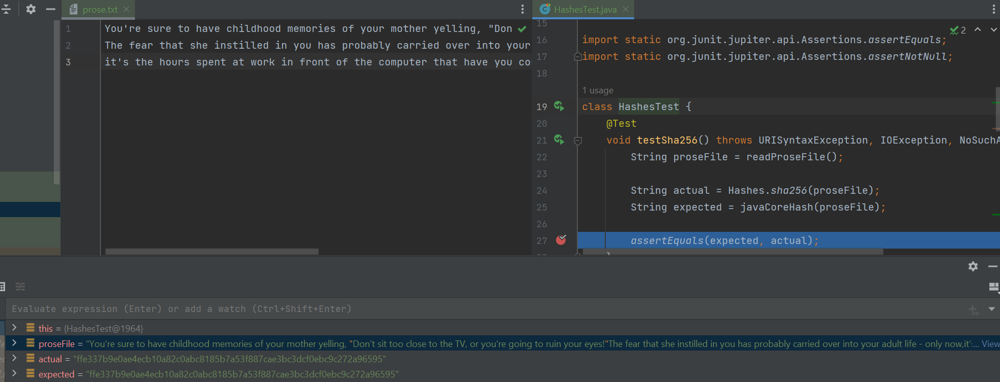

# Лабораторна робота №1

## Гешування

#### Виконав: Безпалий Марко Леонідович, КН-М922в

### Завдання:

Дослідити існуючі механізми гешування. Реалізувати алгоритм гешування SHA (будь-якої версії). Реализацію інших
алгоритмів гешування слід омовити з викладачем.

Довести коректність роботи реалізованого алгоритму шляхом порівняння результатів з існуючими реалізаціями
(напр. утилітою `sha1sum`).

### Опис роботи:

У роботі було реалізовано алгоритм гешування `SHA256` за допомогою статті, що пояснює принцип дії цього алгоритму:
https://blog.boot.dev/cryptography/how-sha-2-works-step-by-step-sha-256/

Спочатку було ініціалізовано константі значення для майбутніх добутків, це два списки чисел у HEX-форматі,
один містить 64 числа (Кожне значення — це перші 32 біти дробових частин кубічного коріння перших 64 простих чисел (
2–311)),
другий містить 8 чисел (Це константи, що представляють перші 32 біти дробових частин квадратного коріння перших 8
простих чисел: 2, 3, 5, 7, 11, 13, 17, 19)

````
0x428a2f98, 0x71374491, 0xb5c0fbcf, 0xe9b5dba5, 0x3956c25b, 0x59f111f1, 0x923f82a4, 0xab1c5ed5,
0xd807aa98, 0x12835b01, 0x243185be, 0x550c7dc3, 0x72be5d74, 0x80deb1fe, 0x9bdc06a7, 0xc19bf174,
0xe49b69c1, 0xefbe4786, 0x0fc19dc6, 0x240ca1cc, 0x2de92c6f, 0x4a7484aa, 0x5cb0a9dc, 0x76f988da,
0x983e5152, 0xa831c66d, 0xb00327c8, 0xbf597fc7, 0xc6e00bf3, 0xd5a79147, 0x06ca6351, 0x14292967,
0x27b70a85, 0x2e1b2138, 0x4d2c6dfc, 0x53380d13, 0x650a7354, 0x766a0abb, 0x81c2c92e, 0x92722c85,
0xa2bfe8a1, 0xa81a664b, 0xc24b8b70, 0xc76c51a3, 0xd192e819, 0xd6990624, 0xf40e3585, 0x106aa070,
0x19a4c116, 0x1e376c08, 0x2748774c, 0x34b0bcb5, 0x391c0cb3, 0x4ed8aa4a, 0x5b9cca4f, 0x682e6ff3,
0x748f82ee, 0x78a5636f, 0x84c87814, 0x8cc70208, 0x90befffa, 0xa4506ceb, 0xbef9a3f7, 0xc67178f2
````

````
0x6a09e667, 0xbb67ae85, 0x3c6ef372, 0xa54ff53a, 0x510e527f, 0x9b05688c, 0x1f83d9ab, 0x5be0cd19
````

Далі були отримані байти вхідного тексту, до них додалась одниция у форматі BIG_ENDIAN та розмір вхідного тексту у
бітах.
Між доданою одиницею та розміром було додано нулі до тих пір, поки розмір не буде кратним 512.

````
byte[] inputByteArray = input.getBytes();
byte[] sizeInBytesArray = longToBytes((long) inputByteArray.length * Long.BYTES);

List<Byte> sizeInByteList = toByteList(sizeInBytesArray);
List<Byte> byteList = toByteList(inputByteArray);
byteList.add(Byte.MIN_VALUE);
byteList.addAll(sizeInByteList);

while (notMultipleOf512(byteList)) {
         byteList.add(byteList.size() - Long.BYTES, (byte) 0);
}
````

#### Розділимо список байтів на групи по 512 біт (або по 64 байти)

````
List<List<Byte>> batch512Bits = ListUtils.partition(byteList, Long.SIZE);
````

#### Для кожних 512 бітів виконуємо наступні дії:

* розділяємо біти по 4 байти (word)
    * для цього використовуємо тип даних `int`
* додаємо нулі, щоб список містив 64 елементи
* у циклі, починаючи з елементу з індексом 16 вираховуємо нове значення елементів
    * `words.set(i, words.get(i - 16) + s0 + words.get(i - 7) + s1)`
    * де `s0` = `(w[i-15] rightrotate 7) xor (w[i-15] rightrotate 18) xor (w[i-15] righthift 3)`
    * `s1` = `(w[i-2] rightrotate 17) xor (w[i-2] rightrotate 19) xor (w[i-2] righthift 10)`
* Ініціалізуємо змінні a, b, c, d, e, f, g, h та встановимо їх рівними поточним значенням хешу відповідно. h0, h1, h2, h3, h4, h5, h6, h7
* у наступному циклі вираховуємо нові значення для 8 констант
  *  `S1 = (e rightrotate 6) xor (e rightrotate 11) xor (e rightrotate 25)`
  *  `ch = (e and f) xor ((not e) and g)`
  *  `temp1 = h + S1 + ch + k[i] + w[i]`
  *  `S0 = (a rightrotate 2) xor (a rightrotate 13) xor (a rightrotate 22)`
  *  `maj = (a and b) xor (a and c) xor (b and c)`
  *  `temp2 := S0 + maj`
  *  `h = g`
  *  `g = f`
  *  `f = e`
  *  `e = d + temp1`
  *  `d = c`
  *  `c = b`
  *  `b = a`
  *  `a = temp1 + temp2` 
  
#### Отримані значення з'єднуємо як строки в HEX-системі числення, що й буде результатом
#### Тест пройдено успішно
